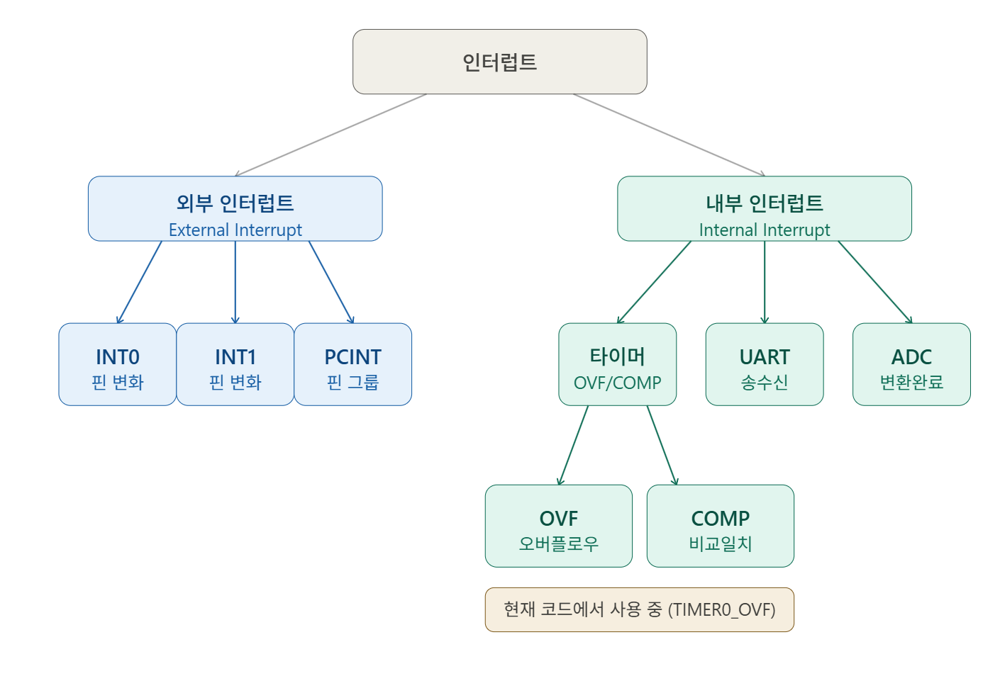
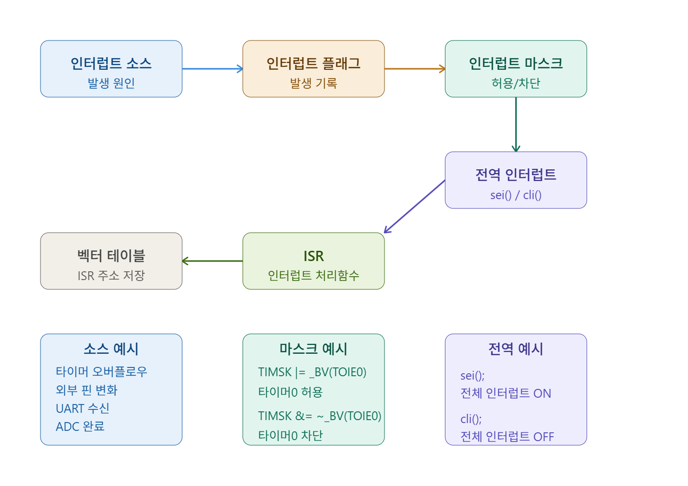

# Chanpark2026

---
고려대 개발자 양성과정 저장소

---

## 2026-03-09

---

- 구글 슬라이드 설치
- ws 설치
- vscode, git 설치
- OS 설명 (리눅스, wsl2 사용)
vs code remote 연결
hello world c 프로그램 작성
literal 프로그램 작성
limit 프로그램 작성

## 2026-03-10

연산자 프로그램 작성
보수의 개념 이해
? :는 조건 연산자 example: //printf("%c 는 %s입니다", ch, isalphabet ? "알파벳" : "알파벳이 아님"); %c는 사용자에게 전달받는 값 결과가 참이면 앞에있는 문자 거짓일 경우 뒤에있는 문자
||는 or로 두 비트중 하나만 참이여도 1로 계산 //isalphabet = ('A' <= ch && ch <= 'Z') || ('a' <= ch && ch <= 'z'); 둘중 하나에만 해당되도 앞에있는 1값으로 printf
double은 결과값을 비트의 형태로 만들어줌
[C언어 기초 공부](https://opentutorials.org/module/3921/23508)

## 2026-03-11

---
흐름제어 (Control Flow)

### 조건문 (Conditional Statements)

#### 1. if ~ else 문

- 조건의 참/거짓에 따라 다른 코드 블록 실행
- 형식:

```c
if (조건) {
    // 조건이 참일 때 실행
} else {
    // 조건이 거짓일 때 실행
}
```

- 중첩 가능: if 안에 또 다른 if 사용 가능
- 삼항 연산자: `조건 ? 참값 : 거짓값` (간단한 경우 사용)

#### 2. switch 문

- 하나의 값에 대해 여러 case를 비교
- break 없으면 아래 case도 계속 실행 ( fall-through )
- 형식:

```c
switch (값) {
    case 1:
        // 값이 1일 때
        break;
    case 2:
        // 값이 2일 때
        break;
    default:
        // 어떤 case도 매칭되지 않을 때
        break;
}
```

- if문과 다르게 매칭된 case부터 실행
- break 필수! (하지 않으면 다음 case도 실행됨)

---

### 반복문 (Loops)

#### 1. for 문

- 횟수가 정해진 반복에 적합
- 형식: `for (초기화; 조건; 증감식)`
- 실행 흐름: 초기화 → 조건검증 → 본문 → 증감식 → 조건검증 → ...

```c
for (int i = 0; i < 10; ++i) {
    // i가 0부터 9까지 10번 실행
}
```

- ++i (선행 증가): 값을 먼저 증가 후 사용
- i++ (후행 증가): 값을 먼저 사용 후 증가

#### 2. while 문

- 조건이 참인 동안 반복
- 형식: `while (조건)`
- 조건이 처음부터 false면 한 번도 실행 안 함

```c
while (조건) {
    // 조건이 true인 동안 반복
}
```

#### 3. do ~ while 문

- 최소 한 번은 실행 보장
- 형식: `do { ... } while (조건);`
- 조건이 뒤에 위치: 먼저 본문 실행 후 조건 검사

```c
do {
    // 최소 한 번 실행
} while (조건);
```

#### 4. 중첩 for 문

- for 문 안에 또 다른 for 문
- 주로 2차원 배열, 구구단 등에서 사용

---

### 제어 키워드

- **break**: 현재 반복문 또는 switch 블록 탈출
- **continue**: 현재 반복skip하고 다음 반복으로 이동
- **return**: 함수 종료 및 값 반환

---

### 실습 예제

- passFail.c: if~else로 합격/불합격 판단
- scoreGradeSwitch.c: switch로 점수 등급 매기기
- one2TenSum.c: for 문으로 1~10 합계
- one2TenWhile.c: while 문으로 1~10 출력

---

### 변수 (Variables)

#### 전역 변수 (Global Variable)

- 함수 외부에서 선언
- 프로그램 전체에서 사용 가능
- 메모리의 Data 영역에 저장

#### 지역 변수 (Local Variable)

- 함수 내부에서 선언
- 해당 함수 내에서만 사용 가능
- 메모리의 Stack 영역에 저장

#### 범위 (Scope)

- 변수가 접근 가능한 영역
- 중괄호 `{}` 내에서 선언된 변수는 그 블록 내에서만 유효

---

#### 프로그래머스 사이트 > 코딩테스트 난이도 0 C 언어로 문제 풀어보기

배열 array
타입의 묶음 ex int 를 묶기, char, float ,사용자 정의 타입도 묶을수 있음
변수명 뒤애 []를 사용하면 됨
ex: int[10]
메모리의 범위를 넘으면 안된다.
n-> [0,n)
0~n-1 까지만 접근가능

## 배열 (Array) 간략 설명

### 정의

- 동일한 타입의 여러 값을 하나의 변수 저장하는 자료구조
- 메모리에 연속적으로 배치됨

### 선언 및 사용

```c
int arr[5];        // 5개의 정수를 저장할 배열 선언
arr[0] = 10;       // 첫 번째 요소에 값 저장 (인덱스는 0부터 시작)
arr[4] = 50;       // 마지막 요소 (인덱스 4)
```

### 중요 특성

- **인덱스**: 0부터 시작 (arr[0]이 첫 번째 요소)
- **크기**: n개 요소 인덱스 범위는 0 ~ n-1
- **메모리**: 선언한 크기를 초과하면 버그 발생 (범위 외 접근 금지)
- **초기화**: `int arr[5] = {1, 2, 3, 4, 5};` 또는 `int arr[] = {1, 2, 3};`

### 실습 예제 (lotto.c)

```c
int lotto[6];      // 로또 번호 6개 저장할 배열
lotto[i] = (rand() % 45) + 1;  // 각 요소에 랜덤 값 저장
```

---

## 오늘 작성한 배열 활용 코드 예제

### 1. lotto.c - 중복 없는 로또 번호 생성

```c
int lotto[6];      // 6개의 로또 번호 저장 배열
for(int i=0; i < 6; ++i){
    lotto[i] = (rand() % 45) + 1;  // 1~45 랜덤 번호 생성
    // 중복 검사: 현재 번호와 이전에 생성된 번호들 비교
    for (int j = 0; j < i; j++){
        if(lotto[i] == lotto[j]){  // 중복이면
            i--;  // 다시 생성하기 위해 인덱스 감소
            break;
        }
    }
}
```

- **배열 활용**: 생성된 번호를 배열에 저장하고, 새 번호와 이전 번호들을 비교하여 중복 제거

### 2. finMax.c - 배열에서 최대값 찾기

```c
#define MAXINDEX 50
int nums[MAXINDEX];  // 50개 요소 배열

// 배열에 랜덤 값 저장
for(int i=0; i < MAXINDEX; ++i){
    nums[i] = rand() % 1000;
}

// 최대값 찾기: 첫 번째 요소로 시작
int max = nums[0];
for (int i = 0; i < MAXINDEX; ++i){
    if (max < nums[i]){
        max = nums[i];  // 현재 요소가 더 크면 최대값 변경
    }
}
```

- **배열 활용**: 배열을 순회하며 모든 요소를 하나씩 비교하여 최대값 찾기

### 3. sumArray.c - 배열 요소 총합 구하기

```c
int num[10];  // 10개 요소 배열

// 배열에 랜덤 값 (1~6) 저장
for (int i = 0; i < 10; ++i){
    num[i] = rand() % 6 + 1;
}

// 총합 계산
int sum = 0;  // 합계 변수 초기화 필수!
for (int i = 0; i < 10; ++i){
    sum += num[i];  // sum = sum + num[i]
}
```

- **배열 활용**: for 루프로 배열 전체를 순회하며 요소 값들을 누적하여 더함

### 4. sumMatrix.c - 2D 배열 (행렬) 의 총합

```c
int matrix[3][4] = {  // 3행 4열 2차원 배열
    {1, 2, 3, 4},
    {11, 12, 13, 14},
    {21, 22, 23, 24}
};

int sum = 0;
for (int i = 0; i < 3; ++i){      // 행 루프
    for (int j = 0; j < 4; ++j){  // 열 루프
        sum += matrix[i][j];     // 2차원 배열 요소 접근
    }
}
```

- **배열 활용**: 중첩 for 문으로 2차원 배열의 모든 요소 접근 및 총합 계산

----

### 2026-03-12

정렬 (sorting)
swap 은 데이터의 순서를 바꿈

함수 원형의 규칙
TYPE 식별자
식별자 : printf(type 변수명)

()괄호안을 argument 라고 부름

TYPE: return type

TYPE 식별자(argument)
{
    실제코드
    return //return 은 타입과 종류가 맞아야함
}

---
메모리

스택메모리 :프로그램 시작시 쌓이는 메모리
return 키워드가 변수를 메인으로 넘겨주면서 사라짐
지역변수는 한번 스택에 메모리를 저장하고 return 시 메모리가 사라짐

----
선택 정렬

1. 첫자리를 알맞게 1번 순회 n-1 번
2. 두번째 자리를 알맞게 n-2 번
만약 10개의 데이터라면 1부터 9까지의 합으로 연산이 이루어짐
n-1번 정렬

----

버블정렬
선택정렬은 index하나를기준으로 버블정렬은 연산하는 index가 위로 올라감
n^2/2

-----
포인터 pointer

무언가를 가리키는 변수
주소를 가지고 있어야 가리킬 수 있음
주소값을 저장하는 변수

포인터 변수 선언 예시:
int *a

기본 사용 흐름

1. 주소 얻기: a = &x  // &는 x의 주소
2. 값 접근: *a         //*는 주소가 가리키는 값

왜 쓰나
함수에서 값 변경(참조 전달), 배열/문자열 접근, 동적 메모리 등에 필요

주의
초기화하지 않은 포인터 사용 금지
해제된 메모리를 가리키면 오류 발생

- 참조연산자
& 역참조연산자
[포인터 개념](https://sejong-kr.libguides.com/c.php?g=942235&p=6822366)

포인터를 사용한 구조

1. 함수   함수 포인터  함수포인트는 함수를 가르킴
함수명 자체를 포인터로 씀 함수명 =포인터
2. 배열  ex : abc[] 배열명 = 포인터

함수의 인자로 참조연산자 *쓰는 5가지 상황

1. 호출하는쪽의 변수를 호출 당하는 쪽에서 변경할떄
2. 배열을 인자로 넘길때
3. 구조체를 인자로 넘길때
4. 사용자 정의 연산(함수)를 인자로 넘길때
5. 임의의 자료 넘길때 void*

예시 (int main(void)에서 사용)

int main(void) {
    int x = 10, y = 20;
    swap(&x, &y);                 // 1) 호출하는쪽 변수를 변경할 때 (&로 주소 전달)

    int arr[5] = {1, 2, 3, 4, 5};
    int sum = sum_array(arr, 5);  // 2) 배열을 인자로 넘길 때 (배열명은 포인터로 전달)

    struct Point p = {0, 0};
    move_point(&p, 3, 4);         // 3) 구조체를 인자로 넘길 때 (구조체 포인터 전달)

    int result = apply(add, 3, 4); // 4) 사용자 정의 연산(함수)을 인자로 넘길 때

    dump_bytes(&x, sizeof(x));    // 5) 임의의 자료 넘길 때 (void*로 데이터 전달)

    return 0;
}


### 2026-03-13

type* 식별자  
type *식별자 

배열을 인자로 넘길때 index를 같이 넘거야한다 

정렬 data structure

선택 정렬 n^2/2
버블 정렬 n^2/2
qsort n~n^2/2

indexing 

#### 2026-03-16 week 2 

분할 컴파일 

기능별로 파일을 관리할수 있다

코드의 재사용을 쉽게 할 수 있다 -> 라이브러리의 배포까지 이어짐 
 

구조체 -> class 객체 지향 언어 
struct :사용자 정의 타입  -> 데이터를 묶어서 다룰때 , 새로운 데이터 형태를 만들고 싶을때 사용한다 
typedef : A B   B라고 하는 타입을  A 처럼 쓴다 " 별명 붙이기 " 가독성을 높여준다 

사용자정의 타입은 대문자로 작성. 
 
공용체 Union
두가지 이상의 type을 사용가능   메모리를 최대한 아낄때 사용. 연속성 유지하기 어려움
하나의 메모리의 접근하는 방식 

--
열거형 enum 

switch case 문과 많이 쓰인다 
enum 으로 작성되는 define 들은 다 int 다 


파일 디스크립터 fd (리눅스)
열려있는 파일들을 다룰때 사용 
int 파일을 열때 
fd  0 입력 키보드 scanf  fscanf(0)
    1 출력 화면  printf fprintf(1) 
    2 에러 error 의 통로를 통해 화면으로 나옴 
    3 


표준 입출력 함소 <stdio.h>
put fput    scanf fscanf 

get fget  printf  fprintf 

### 2026-03-17

구조체는 선언을 따로 하지 않아도 된다 

변수선언만 해주면 됨 

---
표준 입출력 함수 정리 (간략)

- 헤더: `#include <stdio.h>`
- 입력/출력 스트림: `stdin`, `stdout`, `stderr`

- 문자/문자열 입력
- `getchar()` : 표준 입력에서 문자 1개 읽기 (정수로 반환, `EOF` 가능)
- `fgetc(FILE *fp)` : 지정한 파일에서 문자 1개 읽기
- `gets()` : 사용 금지 (버퍼 오버플로우 위험)
- `fgets(char *buf, int n, FILE *fp)` : 최대 `n-1`개 읽고 널 종료, 안전함
- `scanf("형식", &var)` : 형식에 맞게 입력 (공백/개행 기준)
- `fscanf(FILE *fp, "형식", &var)` : 파일에서 형식 입력

- 문자/문자열 출력
- `putchar(int c)` : 문자 1개 출력
- `fputc(int c, FILE *fp)` : 파일에 문자 1개 출력
- `puts(const char *s)` : 문자열 출력 후 개행
- `fputs(const char *s, FILE *fp)` : 파일에 문자열 출력 (개행 없음)
- `printf("형식", ...)` : 형식 출력
- `fprintf(FILE *fp, "형식", ...)` : 파일에 형식 출력

- 버퍼/스트림 제어
- `fflush(FILE *fp)` : 출력 버퍼 비우기 (`stdout`에서 자주 사용)
- `fopen`, `fclose` : 파일 열기/닫기

- 간단 사용 예

```c
char name[32];
printf("name: ");
fgets(name, sizeof(name), stdin);
printf("hello %s", name);
```

---;

동적 할당
dynamic allocate

heap영역에 메모리를 확보할때 사용한다.

메모리는 runtime 에서 할당이된다.


### 2026-03-18

file descriptor 를 붙여서 디바이스를 관리한다.

FILE

핵심적인 built in 구조체 

malloc 을 사용후 free를 반드시 써줘야한다 그렇지 않으면 메모리 누수가 일어난다 .

calloc 
realloc 1. 큰메모리 확보 2. 데이터 이동 3.기존 메모리 free. 

자료구조 data structure

--선형 자료구조.
- 배열 
- 리스트 linked list 
스택 stack first in last out. 
큐 Queue first in first out 

--비선형 자료 구조 
트리 (이진트리 )
그래프 

### 2026-03-19

IOT (Internet of Things) 펌웨어 -> mcu 

### 2025-03-23

#### ATmega128A


<svg width="100%" viewBox="0 0 680 980" xmlns="http://www.w3.org/2000/svg">
  <defs>
    <marker id="arrow" viewBox="0 0 10 10" refX="8" refY="5" markerWidth="6" markerHeight="6" orient="auto-start-reverse">
      <path d="M2 1L8 5L2 9" fill="none" stroke="context-stroke" stroke-width="1.5" stroke-linecap="round" stroke-linejoin="round"/>
    </marker>
  </defs>

  <!-- ===== SECTION 1: 마이크로 컨트롤러 ===== -->
  <g style="fill:rgb(0, 0, 0);stroke:none;color:rgb(0, 0, 0);stroke-width:1px;stroke-linecap:butt;stroke-linejoin:miter;opacity:1;font-family:&quot;Anthropic Sans&quot;, -apple-system, BlinkMacSystemFont, &quot;Segoe UI&quot;, sans-serif;font-size:16px;font-weight:400;text-anchor:start;dominant-baseline:auto">
    <rect x="20" y="20" width="640" height="36" rx="8" stroke-width="0.5" style="fill:rgb(238, 237, 254);stroke:rgb(83, 74, 183);color:rgb(0, 0, 0);stroke-width:0.5px;stroke-linecap:butt;stroke-linejoin:miter;opacity:1;font-family:&quot;Anthropic Sans&quot;, -apple-system, BlinkMacSystemFont, &quot;Segoe UI&quot;, sans-serif;font-size:16px;font-weight:400;text-anchor:start;dominant-baseline:auto"/>
    <text x="340" y="38" text-anchor="middle" dominant-baseline="central" style="fill:rgb(60, 52, 137);stroke:none;color:rgb(0, 0, 0);stroke-width:1px;stroke-linecap:butt;stroke-linejoin:miter;opacity:1;font-family:&quot;Anthropic Sans&quot;, -apple-system, BlinkMacSystemFont, &quot;Segoe UI&quot;, sans-serif;font-size:14px;font-weight:500;text-anchor:middle;dominant-baseline:central">1. 마이크로 컨트롤러 (MCU)</text>
  </g>

  <!-- MPU vs MCU 비교 -->
  <g style="fill:rgb(0, 0, 0);stroke:none;color:rgb(0, 0, 0);stroke-width:1px;stroke-linecap:butt;stroke-linejoin:miter;opacity:1;font-family:&quot;Anthropic Sans&quot;, -apple-system, BlinkMacSystemFont, &quot;Segoe UI&quot;, sans-serif;font-size:16px;font-weight:400;text-anchor:start;dominant-baseline:auto">
    <rect x="30" y="68" width="290" height="120" rx="8" stroke-width="0.5" style="fill:rgb(241, 239, 232);stroke:rgb(95, 94, 90);color:rgb(0, 0, 0);stroke-width:0.5px;stroke-linecap:butt;stroke-linejoin:miter;opacity:1;font-family:&quot;Anthropic Sans&quot;, -apple-system, BlinkMacSystemFont, &quot;Segoe UI&quot;, sans-serif;font-size:16px;font-weight:400;text-anchor:start;dominant-baseline:auto"/>
    <text x="175" y="90" text-anchor="middle" dominant-baseline="central" style="fill:rgb(68, 68, 65);stroke:none;color:rgb(0, 0, 0);stroke-width:1px;stroke-linecap:butt;stroke-linejoin:miter;opacity:1;font-family:&quot;Anthropic Sans&quot;, -apple-system, BlinkMacSystemFont, &quot;Segoe UI&quot;, sans-serif;font-size:14px;font-weight:500;text-anchor:middle;dominant-baseline:central">마이크로 프로세서 (MPU)</text>
  </g>
  <text x="46" y="112" style="fill:rgb(61, 61, 58);stroke:none;color:rgb(0, 0, 0);stroke-width:1px;stroke-linecap:butt;stroke-linejoin:miter;opacity:1;font-family:&quot;Anthropic Sans&quot;, -apple-system, BlinkMacSystemFont, &quot;Segoe UI&quot;, sans-serif;font-size:12px;font-weight:400;text-anchor:start;dominant-baseline:auto">• CPU를 단일 IC칩으로 집적</text>
  <text x="46" y="130" style="fill:rgb(61, 61, 58);stroke:none;color:rgb(0, 0, 0);stroke-width:1px;stroke-linecap:butt;stroke-linejoin:miter;opacity:1;font-family:&quot;Anthropic Sans&quot;, -apple-system, BlinkMacSystemFont, &quot;Segoe UI&quot;, sans-serif;font-size:12px;font-weight:400;text-anchor:start;dominant-baseline:auto">• 주변 하드웨어 별도 필요</text>
  <text x="46" y="148" style="fill:rgb(61, 61, 58);stroke:none;color:rgb(0, 0, 0);stroke-width:1px;stroke-linecap:butt;stroke-linejoin:miter;opacity:1;font-family:&quot;Anthropic Sans&quot;, -apple-system, BlinkMacSystemFont, &quot;Segoe UI&quot;, sans-serif;font-size:12px;font-weight:400;text-anchor:start;dominant-baseline:auto">• 범용 컴퓨터에 사용</text>
  <text x="46" y="166" style="fill:rgb(61, 61, 58);stroke:none;color:rgb(0, 0, 0);stroke-width:1px;stroke-linecap:butt;stroke-linejoin:miter;opacity:1;font-family:&quot;Anthropic Sans&quot;, -apple-system, BlinkMacSystemFont, &quot;Segoe UI&quot;, sans-serif;font-size:12px;font-weight:400;text-anchor:start;dominant-baseline:auto">• 1971년 Intel 4004 (4bit) 시초</text>

  <g style="fill:rgb(0, 0, 0);stroke:none;color:rgb(0, 0, 0);stroke-width:1px;stroke-linecap:butt;stroke-linejoin:miter;opacity:1;font-family:&quot;Anthropic Sans&quot;, -apple-system, BlinkMacSystemFont, &quot;Segoe UI&quot;, sans-serif;font-size:16px;font-weight:400;text-anchor:start;dominant-baseline:auto">
    <rect x="360" y="68" width="290" height="120" rx="8" stroke-width="0.5" style="fill:rgb(225, 245, 238);stroke:rgb(15, 110, 86);color:rgb(0, 0, 0);stroke-width:0.5px;stroke-linecap:butt;stroke-linejoin:miter;opacity:1;font-family:&quot;Anthropic Sans&quot;, -apple-system, BlinkMacSystemFont, &quot;Segoe UI&quot;, sans-serif;font-size:16px;font-weight:400;text-anchor:start;dominant-baseline:auto"/>
    <text x="505" y="90" text-anchor="middle" dominant-baseline="central" style="fill:rgb(8, 80, 65);stroke:none;color:rgb(0, 0, 0);stroke-width:1px;stroke-linecap:butt;stroke-linejoin:miter;opacity:1;font-family:&quot;Anthropic Sans&quot;, -apple-system, BlinkMacSystemFont, &quot;Segoe UI&quot;, sans-serif;font-size:14px;font-weight:500;text-anchor:middle;dominant-baseline:central">마이크로 컨트롤러 (MCU)</text>
  </g>
  <text x="376" y="112" style="fill:rgb(61, 61, 58);stroke:none;color:rgb(0, 0, 0);stroke-width:1px;stroke-linecap:butt;stroke-linejoin:miter;opacity:1;font-family:&quot;Anthropic Sans&quot;, -apple-system, BlinkMacSystemFont, &quot;Segoe UI&quot;, sans-serif;font-size:12px;font-weight:400;text-anchor:start;dominant-baseline:auto">• CPU + 메모리 + I/O 한 칩에 집적</text>
  <text x="376" y="130" style="fill:rgb(61, 61, 58);stroke:none;color:rgb(0, 0, 0);stroke-width:1px;stroke-linecap:butt;stroke-linejoin:miter;opacity:1;font-family:&quot;Anthropic Sans&quot;, -apple-system, BlinkMacSystemFont, &quot;Segoe UI&quot;, sans-serif;font-size:12px;font-weight:400;text-anchor:start;dominant-baseline:auto">• Single-Chip Microcomputer</text>
  <text x="376" y="148" style="fill:rgb(61, 61, 58);stroke:none;color:rgb(0, 0, 0);stroke-width:1px;stroke-linecap:butt;stroke-linejoin:miter;opacity:1;font-family:&quot;Anthropic Sans&quot;, -apple-system, BlinkMacSystemFont, &quot;Segoe UI&quot;, sans-serif;font-size:12px;font-weight:400;text-anchor:start;dominant-baseline:auto">• 특수 목적 기기 제어용</text>
  <text x="376" y="166" style="fill:rgb(61, 61, 58);stroke:none;color:rgb(0, 0, 0);stroke-width:1px;stroke-linecap:butt;stroke-linejoin:miter;opacity:1;font-family:&quot;Anthropic Sans&quot;, -apple-system, BlinkMacSystemFont, &quot;Segoe UI&quot;, sans-serif;font-size:12px;font-weight:400;text-anchor:start;dominant-baseline:auto">• 1975년 TI TMS1000 시초</text>

  <text x="340" y="130" text-anchor="middle" style="fill:rgb(61, 61, 58);stroke:none;color:rgb(0, 0, 0);stroke-width:1px;stroke-linecap:butt;stroke-linejoin:miter;opacity:1;font-family:&quot;Anthropic Sans&quot;, -apple-system, BlinkMacSystemFont, &quot;Segoe UI&quot;, sans-serif;font-size:12px;font-weight:400;text-anchor:middle;dominant-baseline:auto">vs</text>

  <!-- MCU 특징 -->
  <g style="fill:rgb(0, 0, 0);stroke:none;color:rgb(0, 0, 0);stroke-width:1px;stroke-linecap:butt;stroke-linejoin:miter;opacity:1;font-family:&quot;Anthropic Sans&quot;, -apple-system, BlinkMacSystemFont, &quot;Segoe UI&quot;, sans-serif;font-size:16px;font-weight:400;text-anchor:start;dominant-baseline:auto">
    <rect x="30" y="202" width="620" height="28" rx="6" stroke-width="0.5" style="fill:rgb(230, 241, 251);stroke:rgb(24, 95, 165);color:rgb(0, 0, 0);stroke-width:0.5px;stroke-linecap:butt;stroke-linejoin:miter;opacity:1;font-family:&quot;Anthropic Sans&quot;, -apple-system, BlinkMacSystemFont, &quot;Segoe UI&quot;, sans-serif;font-size:16px;font-weight:400;text-anchor:start;dominant-baseline:auto"/>
    <text x="340" y="216" text-anchor="middle" dominant-baseline="central" style="fill:rgb(12, 68, 124);stroke:none;color:rgb(0, 0, 0);stroke-width:1px;stroke-linecap:butt;stroke-linejoin:miter;opacity:1;font-family:&quot;Anthropic Sans&quot;, -apple-system, BlinkMacSystemFont, &quot;Segoe UI&quot;, sans-serif;font-size:14px;font-weight:500;text-anchor:middle;dominant-baseline:central">MCU 주요 특징 및 응용 분야</text>
  </g>
  <text x="46" y="248" style="fill:rgb(61, 61, 58);stroke:none;color:rgb(0, 0, 0);stroke-width:1px;stroke-linecap:butt;stroke-linejoin:miter;opacity:1;font-family:&quot;Anthropic Sans&quot;, -apple-system, BlinkMacSystemFont, &quot;Segoe UI&quot;, sans-serif;font-size:12px;font-weight:400;text-anchor:start;dominant-baseline:auto">특징: I/O 강화 · 타이머/카운터 내장 · Bit 조작 · 소형화 · 저가 · 높은 신뢰성</text>
  <text x="46" y="266" style="fill:rgb(61, 61, 58);stroke:none;color:rgb(0, 0, 0);stroke-width:1px;stroke-linecap:butt;stroke-linejoin:miter;opacity:1;font-family:&quot;Anthropic Sans&quot;, -apple-system, BlinkMacSystemFont, &quot;Segoe UI&quot;, sans-serif;font-size:12px;font-weight:400;text-anchor:start;dominant-baseline:auto">응용: 산업(모터/로봇) · 가전(밥솥/세탁기) · 자동차(점화/연료) · 통신(휴대폰) · 군사</text>
  <text x="46" y="284" style="fill:rgb(61, 61, 58);stroke:none;color:rgb(0, 0, 0);stroke-width:1px;stroke-linecap:butt;stroke-linejoin:miter;opacity:1;font-family:&quot;Anthropic Sans&quot;, -apple-system, BlinkMacSystemFont, &quot;Segoe UI&quot;, sans-serif;font-size:12px;font-weight:400;text-anchor:start;dominant-baseline:auto">발전 방향: 고성능(32bit ARM) · 다기능 · 소형화 · 저전력 · 저가격(1$ 이하)</text>

  <!-- ===== SECTION 2: AVR 마이크로 컨트롤러 ===== -->
  <g style="fill:rgb(0, 0, 0);stroke:none;color:rgb(0, 0, 0);stroke-width:1px;stroke-linecap:butt;stroke-linejoin:miter;opacity:1;font-family:&quot;Anthropic Sans&quot;, -apple-system, BlinkMacSystemFont, &quot;Segoe UI&quot;, sans-serif;font-size:16px;font-weight:400;text-anchor:start;dominant-baseline:auto">
    <rect x="20" y="308" width="640" height="36" rx="8" stroke-width="0.5" style="fill:rgb(250, 236, 231);stroke:rgb(153, 60, 29);color:rgb(0, 0, 0);stroke-width:0.5px;stroke-linecap:butt;stroke-linejoin:miter;opacity:1;font-family:&quot;Anthropic Sans&quot;, -apple-system, BlinkMacSystemFont, &quot;Segoe UI&quot;, sans-serif;font-size:16px;font-weight:400;text-anchor:start;dominant-baseline:auto"/>
    <text x="340" y="326" text-anchor="middle" dominant-baseline="central" style="fill:rgb(113, 43, 19);stroke:none;color:rgb(0, 0, 0);stroke-width:1px;stroke-linecap:butt;stroke-linejoin:miter;opacity:1;font-family:&quot;Anthropic Sans&quot;, -apple-system, BlinkMacSystemFont, &quot;Segoe UI&quot;, sans-serif;font-size:14px;font-weight:500;text-anchor:middle;dominant-baseline:central">2. AVR 마이크로 컨트롤러</text>
  </g>

  <!-- AVR 개요 -->
  <g style="fill:rgb(0, 0, 0);stroke:none;color:rgb(0, 0, 0);stroke-width:1px;stroke-linecap:butt;stroke-linejoin:miter;opacity:1;font-family:&quot;Anthropic Sans&quot;, -apple-system, BlinkMacSystemFont, &quot;Segoe UI&quot;, sans-serif;font-size:16px;font-weight:400;text-anchor:start;dominant-baseline:auto">
    <rect x="30" y="356" width="620" height="28" rx="6" stroke-width="0.5" style="fill:rgb(250, 238, 218);stroke:rgb(133, 79, 11);color:rgb(0, 0, 0);stroke-width:0.5px;stroke-linecap:butt;stroke-linejoin:miter;opacity:1;font-family:&quot;Anthropic Sans&quot;, -apple-system, BlinkMacSystemFont, &quot;Segoe UI&quot;, sans-serif;font-size:16px;font-weight:400;text-anchor:start;dominant-baseline:auto"/>
    <text x="340" y="370" text-anchor="middle" dominant-baseline="central" style="fill:rgb(99, 56, 6);stroke:none;color:rgb(0, 0, 0);stroke-width:1px;stroke-linecap:butt;stroke-linejoin:miter;opacity:1;font-family:&quot;Anthropic Sans&quot;, -apple-system, BlinkMacSystemFont, &quot;Segoe UI&quot;, sans-serif;font-size:14px;font-weight:500;text-anchor:middle;dominant-baseline:central">개요</text>
  </g>
  <text x="46" y="400" style="fill:rgb(61, 61, 58);stroke:none;color:rgb(0, 0, 0);stroke-width:1px;stroke-linecap:butt;stroke-linejoin:miter;opacity:1;font-family:&quot;Anthropic Sans&quot;, -apple-system, BlinkMacSystemFont, &quot;Segoe UI&quot;, sans-serif;font-size:12px;font-weight:400;text-anchor:start;dominant-baseline:auto">• ATMEL사가 1997년 발표한 8비트 제어용 마이크로프로세서</text>
  <text x="46" y="418" style="fill:rgb(61, 61, 58);stroke:none;color:rgb(0, 0, 0);stroke-width:1px;stroke-linecap:butt;stroke-linejoin:miter;opacity:1;font-family:&quot;Anthropic Sans&quot;, -apple-system, BlinkMacSystemFont, &quot;Segoe UI&quot;, sans-serif;font-size:12px;font-weight:400;text-anchor:start;dominant-baseline:auto">• Alf-Egil Bogen + Vegard Wollan의 진보된 RISC 기술 → AVR 명명</text>
  <text x="46" y="436" style="fill:rgb(61, 61, 58);stroke:none;color:rgb(0, 0, 0);stroke-width:1px;stroke-linecap:butt;stroke-linejoin:miter;opacity:1;font-family:&quot;Anthropic Sans&quot;, -apple-system, BlinkMacSystemFont, &quot;Segoe UI&quot;, sans-serif;font-size:12px;font-weight:400;text-anchor:start;dominant-baseline:auto">• 단기간에 8051, PIC을 능가하는 인기 획득</text>

  <!-- AVR 특징 -->
  <g style="fill:rgb(0, 0, 0);stroke:none;color:rgb(0, 0, 0);stroke-width:1px;stroke-linecap:butt;stroke-linejoin:miter;opacity:1;font-family:&quot;Anthropic Sans&quot;, -apple-system, BlinkMacSystemFont, &quot;Segoe UI&quot;, sans-serif;font-size:16px;font-weight:400;text-anchor:start;dominant-baseline:auto">
    <rect x="30" y="454" width="300" height="28" rx="6" stroke-width="0.5" style="fill:rgb(250, 238, 218);stroke:rgb(133, 79, 11);color:rgb(0, 0, 0);stroke-width:0.5px;stroke-linecap:butt;stroke-linejoin:miter;opacity:1;font-family:&quot;Anthropic Sans&quot;, -apple-system, BlinkMacSystemFont, &quot;Segoe UI&quot;, sans-serif;font-size:16px;font-weight:400;text-anchor:start;dominant-baseline:auto"/>
    <text x="180" y="468" text-anchor="middle" dominant-baseline="central" style="fill:rgb(99, 56, 6);stroke:none;color:rgb(0, 0, 0);stroke-width:1px;stroke-linecap:butt;stroke-linejoin:miter;opacity:1;font-family:&quot;Anthropic Sans&quot;, -apple-system, BlinkMacSystemFont, &quot;Segoe UI&quot;, sans-serif;font-size:14px;font-weight:500;text-anchor:middle;dominant-baseline:central">주요 특징</text>
  </g>
  <text x="46" y="498" style="fill:rgb(61, 61, 58);stroke:none;color:rgb(0, 0, 0);stroke-width:1px;stroke-linecap:butt;stroke-linejoin:miter;opacity:1;font-family:&quot;Anthropic Sans&quot;, -apple-system, BlinkMacSystemFont, &quot;Segoe UI&quot;, sans-serif;font-size:12px;font-weight:400;text-anchor:start;dominant-baseline:auto">• RISC 구조 (명령세트 축소)</text>
  <text x="46" y="516" style="fill:rgb(61, 61, 58);stroke:none;color:rgb(0, 0, 0);stroke-width:1px;stroke-linecap:butt;stroke-linejoin:miter;opacity:1;font-family:&quot;Anthropic Sans&quot;, -apple-system, BlinkMacSystemFont, &quot;Segoe UI&quot;, sans-serif;font-size:12px;font-weight:400;text-anchor:start;dominant-baseline:auto">• Harvard Architecture</text>
  <text x="46" y="534" style="fill:rgb(61, 61, 58);stroke:none;color:rgb(0, 0, 0);stroke-width:1px;stroke-linecap:butt;stroke-linejoin:miter;opacity:1;font-family:&quot;Anthropic Sans&quot;, -apple-system, BlinkMacSystemFont, &quot;Segoe UI&quot;, sans-serif;font-size:12px;font-weight:400;text-anchor:start;dominant-baseline:auto">• 32개 8bit 범용 레지스터</text>
  <text x="46" y="552" style="fill:rgb(61, 61, 58);stroke:none;color:rgb(0, 0, 0);stroke-width:1px;stroke-linecap:butt;stroke-linejoin:miter;opacity:1;font-family:&quot;Anthropic Sans&quot;, -apple-system, BlinkMacSystemFont, &quot;Segoe UI&quot;, sans-serif;font-size:12px;font-weight:400;text-anchor:start;dominant-baseline:auto">• CMOS (1.8~5.5V, 저전력)</text>
  <text x="46" y="570" style="fill:rgb(61, 61, 58);stroke:none;color:rgb(0, 0, 0);stroke-width:1px;stroke-linecap:butt;stroke-linejoin:miter;opacity:1;font-family:&quot;Anthropic Sans&quot;, -apple-system, BlinkMacSystemFont, &quot;Segoe UI&quot;, sans-serif;font-size:12px;font-weight:400;text-anchor:start;dominant-baseline:auto">• 1MHz당 1MIPS 처리속도</text>
  <text x="46" y="588" style="fill:rgb(61, 61, 58);stroke:none;color:rgb(0, 0, 0);stroke-width:1px;stroke-linecap:butt;stroke-linejoin:miter;opacity:1;font-family:&quot;Anthropic Sans&quot;, -apple-system, BlinkMacSystemFont, &quot;Segoe UI&quot;, sans-serif;font-size:12px;font-weight:400;text-anchor:start;dominant-baseline:auto">• ISP 기능 (쉬운 다운로드)</text>

  <!-- AVR 종류 -->
  <g style="fill:rgb(0, 0, 0);stroke:none;color:rgb(0, 0, 0);stroke-width:1px;stroke-linecap:butt;stroke-linejoin:miter;opacity:1;font-family:&quot;Anthropic Sans&quot;, -apple-system, BlinkMacSystemFont, &quot;Segoe UI&quot;, sans-serif;font-size:16px;font-weight:400;text-anchor:start;dominant-baseline:auto">
    <rect x="350" y="454" width="300" height="28" rx="6" stroke-width="0.5" style="fill:rgb(250, 238, 218);stroke:rgb(133, 79, 11);color:rgb(0, 0, 0);stroke-width:0.5px;stroke-linecap:butt;stroke-linejoin:miter;opacity:1;font-family:&quot;Anthropic Sans&quot;, -apple-system, BlinkMacSystemFont, &quot;Segoe UI&quot;, sans-serif;font-size:16px;font-weight:400;text-anchor:start;dominant-baseline:auto"/>
    <text x="500" y="468" text-anchor="middle" dominant-baseline="central" style="fill:rgb(99, 56, 6);stroke:none;color:rgb(0, 0, 0);stroke-width:1px;stroke-linecap:butt;stroke-linejoin:miter;opacity:1;font-family:&quot;Anthropic Sans&quot;, -apple-system, BlinkMacSystemFont, &quot;Segoe UI&quot;, sans-serif;font-size:14px;font-weight:500;text-anchor:middle;dominant-baseline:central">시리즈 종류</text>
  </g>

  <g style="fill:rgb(0, 0, 0);stroke:none;color:rgb(0, 0, 0);stroke-width:1px;stroke-linecap:butt;stroke-linejoin:miter;opacity:1;font-family:&quot;Anthropic Sans&quot;, -apple-system, BlinkMacSystemFont, &quot;Segoe UI&quot;, sans-serif;font-size:16px;font-weight:400;text-anchor:start;dominant-baseline:auto">
    <rect x="360" y="492" width="270" height="44" rx="6" stroke-width="0.5" style="fill:rgb(241, 239, 232);stroke:rgb(95, 94, 90);color:rgb(0, 0, 0);stroke-width:0.5px;stroke-linecap:butt;stroke-linejoin:miter;opacity:1;font-family:&quot;Anthropic Sans&quot;, -apple-system, BlinkMacSystemFont, &quot;Segoe UI&quot;, sans-serif;font-size:16px;font-weight:400;text-anchor:start;dominant-baseline:auto"/>
    <text x="495" y="507" text-anchor="middle" dominant-baseline="central" style="fill:rgb(68, 68, 65);stroke:none;color:rgb(0, 0, 0);stroke-width:1px;stroke-linecap:butt;stroke-linejoin:miter;opacity:1;font-family:&quot;Anthropic Sans&quot;, -apple-system, BlinkMacSystemFont, &quot;Segoe UI&quot;, sans-serif;font-size:14px;font-weight:500;text-anchor:middle;dominant-baseline:central">Tiny 시리즈</text>
    <text x="495" y="526" text-anchor="middle" dominant-baseline="central" style="fill:rgb(95, 94, 90);stroke:none;color:rgb(0, 0, 0);stroke-width:1px;stroke-linecap:butt;stroke-linejoin:miter;opacity:1;font-family:&quot;Anthropic Sans&quot;, -apple-system, BlinkMacSystemFont, &quot;Segoe UI&quot;, sans-serif;font-size:12px;font-weight:400;text-anchor:middle;dominant-baseline:central">8~24핀 · 1K-2K Flash · 저속/저가</text>
  </g>

  <g style="fill:rgb(0, 0, 0);stroke:none;color:rgb(0, 0, 0);stroke-width:1px;stroke-linecap:butt;stroke-linejoin:miter;opacity:1;font-family:&quot;Anthropic Sans&quot;, -apple-system, BlinkMacSystemFont, &quot;Segoe UI&quot;, sans-serif;font-size:16px;font-weight:400;text-anchor:start;dominant-baseline:auto">
    <rect x="360" y="544" width="270" height="44" rx="6" stroke-width="0.5" style="fill:rgb(225, 245, 238);stroke:rgb(15, 110, 86);color:rgb(0, 0, 0);stroke-width:0.5px;stroke-linecap:butt;stroke-linejoin:miter;opacity:1;font-family:&quot;Anthropic Sans&quot;, -apple-system, BlinkMacSystemFont, &quot;Segoe UI&quot;, sans-serif;font-size:16px;font-weight:400;text-anchor:start;dominant-baseline:auto"/>
    <text x="495" y="559" text-anchor="middle" dominant-baseline="central" style="fill:rgb(8, 80, 65);stroke:none;color:rgb(0, 0, 0);stroke-width:1px;stroke-linecap:butt;stroke-linejoin:miter;opacity:1;font-family:&quot;Anthropic Sans&quot;, -apple-system, BlinkMacSystemFont, &quot;Segoe UI&quot;, sans-serif;font-size:14px;font-weight:500;text-anchor:middle;dominant-baseline:central">Mega 시리즈 ★</text>
    <text x="495" y="578" text-anchor="middle" dominant-baseline="central" style="fill:rgb(15, 110, 86);stroke:none;color:rgb(0, 0, 0);stroke-width:1px;stroke-linecap:butt;stroke-linejoin:miter;opacity:1;font-family:&quot;Anthropic Sans&quot;, -apple-system, BlinkMacSystemFont, &quot;Segoe UI&quot;, sans-serif;font-size:12px;font-weight:400;text-anchor:middle;dominant-baseline:central">28~100핀 · 8K-256K Flash · 고성능</text>
  </g>

  <!-- ===== SECTION 3: ATMega128A ===== -->
  <g style="fill:rgb(0, 0, 0);stroke:none;color:rgb(0, 0, 0);stroke-width:1px;stroke-linecap:butt;stroke-linejoin:miter;opacity:1;font-family:&quot;Anthropic Sans&quot;, -apple-system, BlinkMacSystemFont, &quot;Segoe UI&quot;, sans-serif;font-size:16px;font-weight:400;text-anchor:start;dominant-baseline:auto">
    <rect x="20" y="620" width="640" height="36" rx="8" stroke-width="0.5" style="fill:rgb(225, 245, 238);stroke:rgb(15, 110, 86);color:rgb(0, 0, 0);stroke-width:0.5px;stroke-linecap:butt;stroke-linejoin:miter;opacity:1;font-family:&quot;Anthropic Sans&quot;, -apple-system, BlinkMacSystemFont, &quot;Segoe UI&quot;, sans-serif;font-size:16px;font-weight:400;text-anchor:start;dominant-baseline:auto"/>
    <text x="340" y="638" text-anchor="middle" dominant-baseline="central" style="fill:rgb(8, 80, 65);stroke:none;color:rgb(0, 0, 0);stroke-width:1px;stroke-linecap:butt;stroke-linejoin:miter;opacity:1;font-family:&quot;Anthropic Sans&quot;, -apple-system, BlinkMacSystemFont, &quot;Segoe UI&quot;, sans-serif;font-size:14px;font-weight:500;text-anchor:middle;dominant-baseline:central">3. ATMega128A 마이크로 컨트롤러</text>
  </g>

  <!-- 사양 -->
  <g style="fill:rgb(0, 0, 0);stroke:none;color:rgb(0, 0, 0);stroke-width:1px;stroke-linecap:butt;stroke-linejoin:miter;opacity:1;font-family:&quot;Anthropic Sans&quot;, -apple-system, BlinkMacSystemFont, &quot;Segoe UI&quot;, sans-serif;font-size:16px;font-weight:400;text-anchor:start;dominant-baseline:auto">
    <rect x="30" y="668" width="195" height="28" rx="6" stroke-width="0.5" style="fill:rgb(230, 241, 251);stroke:rgb(24, 95, 165);color:rgb(0, 0, 0);stroke-width:0.5px;stroke-linecap:butt;stroke-linejoin:miter;opacity:1;font-family:&quot;Anthropic Sans&quot;, -apple-system, BlinkMacSystemFont, &quot;Segoe UI&quot;, sans-serif;font-size:16px;font-weight:400;text-anchor:start;dominant-baseline:auto"/>
    <text x="127" y="682" text-anchor="middle" dominant-baseline="central" style="fill:rgb(12, 68, 124);stroke:none;color:rgb(0, 0, 0);stroke-width:1px;stroke-linecap:butt;stroke-linejoin:miter;opacity:1;font-family:&quot;Anthropic Sans&quot;, -apple-system, BlinkMacSystemFont, &quot;Segoe UI&quot;, sans-serif;font-size:14px;font-weight:500;text-anchor:middle;dominant-baseline:central">핵심 사양</text>
  </g>
  <text x="46" y="710" style="fill:rgb(61, 61, 58);stroke:none;color:rgb(0, 0, 0);stroke-width:1px;stroke-linecap:butt;stroke-linejoin:miter;opacity:1;font-family:&quot;Anthropic Sans&quot;, -apple-system, BlinkMacSystemFont, &quot;Segoe UI&quot;, sans-serif;font-size:12px;font-weight:400;text-anchor:start;dominant-baseline:auto">• 8bit AVR · RISC · 16MHz</text>
  <text x="46" y="728" style="fill:rgb(61, 61, 58);stroke:none;color:rgb(0, 0, 0);stroke-width:1px;stroke-linecap:butt;stroke-linejoin:miter;opacity:1;font-family:&quot;Anthropic Sans&quot;, -apple-system, BlinkMacSystemFont, &quot;Segoe UI&quot;, sans-serif;font-size:12px;font-weight:400;text-anchor:start;dominant-baseline:auto">• 16MIPS 처리속도</text>
  <text x="46" y="746" style="fill:rgb(61, 61, 58);stroke:none;color:rgb(0, 0, 0);stroke-width:1px;stroke-linecap:butt;stroke-linejoin:miter;opacity:1;font-family:&quot;Anthropic Sans&quot;, -apple-system, BlinkMacSystemFont, &quot;Segoe UI&quot;, sans-serif;font-size:12px;font-weight:400;text-anchor:start;dominant-baseline:auto">• 133종 명령세트</text>
  <text x="46" y="764" style="fill:rgb(61, 61, 58);stroke:none;color:rgb(0, 0, 0);stroke-width:1px;stroke-linecap:butt;stroke-linejoin:miter;opacity:1;font-family:&quot;Anthropic Sans&quot;, -apple-system, BlinkMacSystemFont, &quot;Segoe UI&quot;, sans-serif;font-size:12px;font-weight:400;text-anchor:start;dominant-baseline:auto">• 32 × 8bit 범용 레지스터</text>
  <text x="46" y="782" style="fill:rgb(61, 61, 58);stroke:none;color:rgb(0, 0, 0);stroke-width:1px;stroke-linecap:butt;stroke-linejoin:miter;opacity:1;font-family:&quot;Anthropic Sans&quot;, -apple-system, BlinkMacSystemFont, &quot;Segoe UI&quot;, sans-serif;font-size:12px;font-weight:400;text-anchor:start;dominant-baseline:auto">• 동작전압: 2.7~5.5V</text>
  <text x="46" y="800" style="fill:rgb(61, 61, 58);stroke:none;color:rgb(0, 0, 0);stroke-width:1px;stroke-linecap:butt;stroke-linejoin:miter;opacity:1;font-family:&quot;Anthropic Sans&quot;, -apple-system, BlinkMacSystemFont, &quot;Segoe UI&quot;, sans-serif;font-size:12px;font-weight:400;text-anchor:start;dominant-baseline:auto">• 패키지: 64핀 TQFP/MLF</text>

  <!-- 메모리 -->
  <g style="fill:rgb(0, 0, 0);stroke:none;color:rgb(0, 0, 0);stroke-width:1px;stroke-linecap:butt;stroke-linejoin:miter;opacity:1;font-family:&quot;Anthropic Sans&quot;, -apple-system, BlinkMacSystemFont, &quot;Segoe UI&quot;, sans-serif;font-size:16px;font-weight:400;text-anchor:start;dominant-baseline:auto">
    <rect x="245" y="668" width="195" height="28" rx="6" stroke-width="0.5" style="fill:rgb(230, 241, 251);stroke:rgb(24, 95, 165);color:rgb(0, 0, 0);stroke-width:0.5px;stroke-linecap:butt;stroke-linejoin:miter;opacity:1;font-family:&quot;Anthropic Sans&quot;, -apple-system, BlinkMacSystemFont, &quot;Segoe UI&quot;, sans-serif;font-size:16px;font-weight:400;text-anchor:start;dominant-baseline:auto"/>
    <text x="342" y="682" text-anchor="middle" dominant-baseline="central" style="fill:rgb(12, 68, 124);stroke:none;color:rgb(0, 0, 0);stroke-width:1px;stroke-linecap:butt;stroke-linejoin:miter;opacity:1;font-family:&quot;Anthropic Sans&quot;, -apple-system, BlinkMacSystemFont, &quot;Segoe UI&quot;, sans-serif;font-size:14px;font-weight:500;text-anchor:middle;dominant-baseline:central">메모리 구성</text>
  </g>
  <text x="258" y="710" style="fill:rgb(61, 61, 58);stroke:none;color:rgb(0, 0, 0);stroke-width:1px;stroke-linecap:butt;stroke-linejoin:miter;opacity:1;font-family:&quot;Anthropic Sans&quot;, -apple-system, BlinkMacSystemFont, &quot;Segoe UI&quot;, sans-serif;font-size:12px;font-weight:400;text-anchor:start;dominant-baseline:auto">• Flash: 128KB (프로그램)</text>
  <text x="258" y="728" style="fill:rgb(61, 61, 58);stroke:none;color:rgb(0, 0, 0);stroke-width:1px;stroke-linecap:butt;stroke-linejoin:miter;opacity:1;font-family:&quot;Anthropic Sans&quot;, -apple-system, BlinkMacSystemFont, &quot;Segoe UI&quot;, sans-serif;font-size:12px;font-weight:400;text-anchor:start;dominant-baseline:auto">• SRAM: 4KB (데이터)</text>
  <text x="258" y="746" style="fill:rgb(61, 61, 58);stroke:none;color:rgb(0, 0, 0);stroke-width:1px;stroke-linecap:butt;stroke-linejoin:miter;opacity:1;font-family:&quot;Anthropic Sans&quot;, -apple-system, BlinkMacSystemFont, &quot;Segoe UI&quot;, sans-serif;font-size:12px;font-weight:400;text-anchor:start;dominant-baseline:auto">• EEPROM: 4KB (비휘발)</text>
  <text x="258" y="764" style="fill:rgb(61, 61, 58);stroke:none;color:rgb(0, 0, 0);stroke-width:1px;stroke-linecap:butt;stroke-linejoin:miter;opacity:1;font-family:&quot;Anthropic Sans&quot;, -apple-system, BlinkMacSystemFont, &quot;Segoe UI&quot;, sans-serif;font-size:12px;font-weight:400;text-anchor:start;dominant-baseline:auto">• 외부 메모리: 최대 64K</text>
  <text x="258" y="782" style="fill:rgb(61, 61, 58);stroke:none;color:rgb(0, 0, 0);stroke-width:1px;stroke-linecap:butt;stroke-linejoin:miter;opacity:1;font-family:&quot;Anthropic Sans&quot;, -apple-system, BlinkMacSystemFont, &quot;Segoe UI&quot;, sans-serif;font-size:12px;font-weight:400;text-anchor:start;dominant-baseline:auto">• Harvard 구조</text>
  <text x="258" y="800" style="fill:rgb(61, 61, 58);stroke:none;color:rgb(0, 0, 0);stroke-width:1px;stroke-linecap:butt;stroke-linejoin:miter;opacity:1;font-family:&quot;Anthropic Sans&quot;, -apple-system, BlinkMacSystemFont, &quot;Segoe UI&quot;, sans-serif;font-size:12px;font-weight:400;text-anchor:start;dominant-baseline:auto">• JTAG 포트 지원</text>

  <!-- 주변장치 -->
  <g style="fill:rgb(0, 0, 0);stroke:none;color:rgb(0, 0, 0);stroke-width:1px;stroke-linecap:butt;stroke-linejoin:miter;opacity:1;font-family:&quot;Anthropic Sans&quot;, -apple-system, BlinkMacSystemFont, &quot;Segoe UI&quot;, sans-serif;font-size:16px;font-weight:400;text-anchor:start;dominant-baseline:auto">
    <rect x="460" y="668" width="200" height="28" rx="6" stroke-width="0.5" style="fill:rgb(230, 241, 251);stroke:rgb(24, 95, 165);color:rgb(0, 0, 0);stroke-width:0.5px;stroke-linecap:butt;stroke-linejoin:miter;opacity:1;font-family:&quot;Anthropic Sans&quot;, -apple-system, BlinkMacSystemFont, &quot;Segoe UI&quot;, sans-serif;font-size:16px;font-weight:400;text-anchor:start;dominant-baseline:auto"/>
    <text x="560" y="682" text-anchor="middle" dominant-baseline="central" style="fill:rgb(12, 68, 124);stroke:none;color:rgb(0, 0, 0);stroke-width:1px;stroke-linecap:butt;stroke-linejoin:miter;opacity:1;font-family:&quot;Anthropic Sans&quot;, -apple-system, BlinkMacSystemFont, &quot;Segoe UI&quot;, sans-serif;font-size:14px;font-weight:500;text-anchor:middle;dominant-baseline:central">주변장치</text>
  </g>
  <text x="473" y="710" style="fill:rgb(61, 61, 58);stroke:none;color:rgb(0, 0, 0);stroke-width:1px;stroke-linecap:butt;stroke-linejoin:miter;opacity:1;font-family:&quot;Anthropic Sans&quot;, -apple-system, BlinkMacSystemFont, &quot;Segoe UI&quot;, sans-serif;font-size:12px;font-weight:400;text-anchor:start;dominant-baseline:auto">• 타이머: 8bit×2, 16bit×2</text>
  <text x="473" y="728" style="fill:rgb(61, 61, 58);stroke:none;color:rgb(0, 0, 0);stroke-width:1px;stroke-linecap:butt;stroke-linejoin:miter;opacity:1;font-family:&quot;Anthropic Sans&quot;, -apple-system, BlinkMacSystemFont, &quot;Segoe UI&quot;, sans-serif;font-size:12px;font-weight:400;text-anchor:start;dominant-baseline:auto">• PWM: 8채널</text>
  <text x="473" y="746" style="fill:rgb(61, 61, 58);stroke:none;color:rgb(0, 0, 0);stroke-width:1px;stroke-linecap:butt;stroke-linejoin:miter;opacity:1;font-family:&quot;Anthropic Sans&quot;, -apple-system, BlinkMacSystemFont, &quot;Segoe UI&quot;, sans-serif;font-size:12px;font-weight:400;text-anchor:start;dominant-baseline:auto">• ADC: 8채널 10bit</text>
  <text x="473" y="764" style="fill:rgb(61, 61, 58);stroke:none;color:rgb(0, 0, 0);stroke-width:1px;stroke-linecap:butt;stroke-linejoin:miter;opacity:1;font-family:&quot;Anthropic Sans&quot;, -apple-system, BlinkMacSystemFont, &quot;Segoe UI&quot;, sans-serif;font-size:12px;font-weight:400;text-anchor:start;dominant-baseline:auto">• USART: 2개</text>
  <text x="473" y="782" style="fill:rgb(61, 61, 58);stroke:none;color:rgb(0, 0, 0);stroke-width:1px;stroke-linecap:butt;stroke-linejoin:miter;opacity:1;font-family:&quot;Anthropic Sans&quot;, -apple-system, BlinkMacSystemFont, &quot;Segoe UI&quot;, sans-serif;font-size:12px;font-weight:400;text-anchor:start;dominant-baseline:auto">• SPI, TWI(I2C)</text>
  <text x="473" y="800" style="fill:rgb(61, 61, 58);stroke:none;color:rgb(0, 0, 0);stroke-width:1px;stroke-linecap:butt;stroke-linejoin:miter;opacity:1;font-family:&quot;Anthropic Sans&quot;, -apple-system, BlinkMacSystemFont, &quot;Segoe UI&quot;, sans-serif;font-size:12px;font-weight:400;text-anchor:start;dominant-baseline:auto">• Watchdog 타이머</text>

  <!-- I/O 포트 -->
  <g style="fill:rgb(0, 0, 0);stroke:none;color:rgb(0, 0, 0);stroke-width:1px;stroke-linecap:butt;stroke-linejoin:miter;opacity:1;font-family:&quot;Anthropic Sans&quot;, -apple-system, BlinkMacSystemFont, &quot;Segoe UI&quot;, sans-serif;font-size:16px;font-weight:400;text-anchor:start;dominant-baseline:auto">
    <rect x="30" y="822" width="620" height="28" rx="6" stroke-width="0.5" style="fill:rgb(238, 237, 254);stroke:rgb(83, 74, 183);color:rgb(0, 0, 0);stroke-width:0.5px;stroke-linecap:butt;stroke-linejoin:miter;opacity:1;font-family:&quot;Anthropic Sans&quot;, -apple-system, BlinkMacSystemFont, &quot;Segoe UI&quot;, sans-serif;font-size:16px;font-weight:400;text-anchor:start;dominant-baseline:auto"/>
    <text x="340" y="836" text-anchor="middle" dominant-baseline="central" style="fill:rgb(60, 52, 137);stroke:none;color:rgb(0, 0, 0);stroke-width:1px;stroke-linecap:butt;stroke-linejoin:miter;opacity:1;font-family:&quot;Anthropic Sans&quot;, -apple-system, BlinkMacSystemFont, &quot;Segoe UI&quot;, sans-serif;font-size:14px;font-weight:500;text-anchor:middle;dominant-baseline:central">I/O 포트 (53개 프로그래머블)</text>
  </g>

  <g style="fill:rgb(0, 0, 0);stroke:none;color:rgb(0, 0, 0);stroke-width:1px;stroke-linecap:butt;stroke-linejoin:miter;opacity:1;font-family:&quot;Anthropic Sans&quot;, -apple-system, BlinkMacSystemFont, &quot;Segoe UI&quot;, sans-serif;font-size:16px;font-weight:400;text-anchor:start;dominant-baseline:auto">
    <rect x="30" y="860" width="88" height="44" rx="6" stroke-width="0.5" style="fill:rgb(241, 239, 232);stroke:rgb(95, 94, 90);color:rgb(0, 0, 0);stroke-width:0.5px;stroke-linecap:butt;stroke-linejoin:miter;opacity:1;font-family:&quot;Anthropic Sans&quot;, -apple-system, BlinkMacSystemFont, &quot;Segoe UI&quot;, sans-serif;font-size:16px;font-weight:400;text-anchor:start;dominant-baseline:auto"/>
    <text x="74" y="876" text-anchor="middle" dominant-baseline="central" style="fill:rgb(68, 68, 65);stroke:none;color:rgb(0, 0, 0);stroke-width:1px;stroke-linecap:butt;stroke-linejoin:miter;opacity:1;font-family:&quot;Anthropic Sans&quot;, -apple-system, BlinkMacSystemFont, &quot;Segoe UI&quot;, sans-serif;font-size:14px;font-weight:500;text-anchor:middle;dominant-baseline:central">포트A</text>
    <text x="74" y="894" text-anchor="middle" dominant-baseline="central" style="fill:rgb(95, 94, 90);stroke:none;color:rgb(0, 0, 0);stroke-width:1px;stroke-linecap:butt;stroke-linejoin:miter;opacity:1;font-family:&quot;Anthropic Sans&quot;, -apple-system, BlinkMacSystemFont, &quot;Segoe UI&quot;, sans-serif;font-size:12px;font-weight:400;text-anchor:middle;dominant-baseline:central">주소/데이터버스</text>
  </g>
  <g style="fill:rgb(0, 0, 0);stroke:none;color:rgb(0, 0, 0);stroke-width:1px;stroke-linecap:butt;stroke-linejoin:miter;opacity:1;font-family:&quot;Anthropic Sans&quot;, -apple-system, BlinkMacSystemFont, &quot;Segoe UI&quot;, sans-serif;font-size:16px;font-weight:400;text-anchor:start;dominant-baseline:auto">
    <rect x="128" y="860" width="88" height="44" rx="6" stroke-width="0.5" style="fill:rgb(241, 239, 232);stroke:rgb(95, 94, 90);color:rgb(0, 0, 0);stroke-width:0.5px;stroke-linecap:butt;stroke-linejoin:miter;opacity:1;font-family:&quot;Anthropic Sans&quot;, -apple-system, BlinkMacSystemFont, &quot;Segoe UI&quot;, sans-serif;font-size:16px;font-weight:400;text-anchor:start;dominant-baseline:auto"/>
    <text x="172" y="876" text-anchor="middle" dominant-baseline="central" style="fill:rgb(68, 68, 65);stroke:none;color:rgb(0, 0, 0);stroke-width:1px;stroke-linecap:butt;stroke-linejoin:miter;opacity:1;font-family:&quot;Anthropic Sans&quot;, -apple-system, BlinkMacSystemFont, &quot;Segoe UI&quot;, sans-serif;font-size:14px;font-weight:500;text-anchor:middle;dominant-baseline:central">포트B</text>
    <text x="172" y="894" text-anchor="middle" dominant-baseline="central" style="fill:rgb(95, 94, 90);stroke:none;color:rgb(0, 0, 0);stroke-width:1px;stroke-linecap:butt;stroke-linejoin:miter;opacity:1;font-family:&quot;Anthropic Sans&quot;, -apple-system, BlinkMacSystemFont, &quot;Segoe UI&quot;, sans-serif;font-size:12px;font-weight:400;text-anchor:middle;dominant-baseline:central">SPI/PWM</text>
  </g>
  <g style="fill:rgb(0, 0, 0);stroke:none;color:rgb(0, 0, 0);stroke-width:1px;stroke-linecap:butt;stroke-linejoin:miter;opacity:1;font-family:&quot;Anthropic Sans&quot;, -apple-system, BlinkMacSystemFont, &quot;Segoe UI&quot;, sans-serif;font-size:16px;font-weight:400;text-anchor:start;dominant-baseline:auto">
    <rect x="226" y="860" width="88" height="44" rx="6" stroke-width="0.5" style="fill:rgb(241, 239, 232);stroke:rgb(95, 94, 90);color:rgb(0, 0, 0);stroke-width:0.5px;stroke-linecap:butt;stroke-linejoin:miter;opacity:1;font-family:&quot;Anthropic Sans&quot;, -apple-system, BlinkMacSystemFont, &quot;Segoe UI&quot;, sans-serif;font-size:16px;font-weight:400;text-anchor:start;dominant-baseline:auto"/>
    <text x="270" y="876" text-anchor="middle" dominant-baseline="central" style="fill:rgb(68, 68, 65);stroke:none;color:rgb(0, 0, 0);stroke-width:1px;stroke-linecap:butt;stroke-linejoin:miter;opacity:1;font-family:&quot;Anthropic Sans&quot;, -apple-system, BlinkMacSystemFont, &quot;Segoe UI&quot;, sans-serif;font-size:14px;font-weight:500;text-anchor:middle;dominant-baseline:central">포트C</text>
    <text x="270" y="894" text-anchor="middle" dominant-baseline="central" style="fill:rgb(95, 94, 90);stroke:none;color:rgb(0, 0, 0);stroke-width:1px;stroke-linecap:butt;stroke-linejoin:miter;opacity:1;font-family:&quot;Anthropic Sans&quot;, -apple-system, BlinkMacSystemFont, &quot;Segoe UI&quot;, sans-serif;font-size:12px;font-weight:400;text-anchor:middle;dominant-baseline:central">주소버스</text>
  </g>
  <g style="fill:rgb(0, 0, 0);stroke:none;color:rgb(0, 0, 0);stroke-width:1px;stroke-linecap:butt;stroke-linejoin:miter;opacity:1;font-family:&quot;Anthropic Sans&quot;, -apple-system, BlinkMacSystemFont, &quot;Segoe UI&quot;, sans-serif;font-size:16px;font-weight:400;text-anchor:start;dominant-baseline:auto">
    <rect x="324" y="860" width="88" height="44" rx="6" stroke-width="0.5" style="fill:rgb(241, 239, 232);stroke:rgb(95, 94, 90);color:rgb(0, 0, 0);stroke-width:0.5px;stroke-linecap:butt;stroke-linejoin:miter;opacity:1;font-family:&quot;Anthropic Sans&quot;, -apple-system, BlinkMacSystemFont, &quot;Segoe UI&quot;, sans-serif;font-size:16px;font-weight:400;text-anchor:start;dominant-baseline:auto"/>
    <text x="368" y="876" text-anchor="middle" dominant-baseline="central" style="fill:rgb(68, 68, 65);stroke:none;color:rgb(0, 0, 0);stroke-width:1px;stroke-linecap:butt;stroke-linejoin:miter;opacity:1;font-family:&quot;Anthropic Sans&quot;, -apple-system, BlinkMacSystemFont, &quot;Segoe UI&quot;, sans-serif;font-size:14px;font-weight:500;text-anchor:middle;dominant-baseline:central">포트D</text>
    <text x="368" y="894" text-anchor="middle" dominant-baseline="central" style="fill:rgb(95, 94, 90);stroke:none;color:rgb(0, 0, 0);stroke-width:1px;stroke-linecap:butt;stroke-linejoin:miter;opacity:1;font-family:&quot;Anthropic Sans&quot;, -apple-system, BlinkMacSystemFont, &quot;Segoe UI&quot;, sans-serif;font-size:12px;font-weight:400;text-anchor:middle;dominant-baseline:central">타이머/인터럽트</text>
  </g>
  <g style="fill:rgb(0, 0, 0);stroke:none;color:rgb(0, 0, 0);stroke-width:1px;stroke-linecap:butt;stroke-linejoin:miter;opacity:1;font-family:&quot;Anthropic Sans&quot;, -apple-system, BlinkMacSystemFont, &quot;Segoe UI&quot;, sans-serif;font-size:16px;font-weight:400;text-anchor:start;dominant-baseline:auto">
    <rect x="422" y="860" width="88" height="44" rx="6" stroke-width="0.5" style="fill:rgb(241, 239, 232);stroke:rgb(95, 94, 90);color:rgb(0, 0, 0);stroke-width:0.5px;stroke-linecap:butt;stroke-linejoin:miter;opacity:1;font-family:&quot;Anthropic Sans&quot;, -apple-system, BlinkMacSystemFont, &quot;Segoe UI&quot;, sans-serif;font-size:16px;font-weight:400;text-anchor:start;dominant-baseline:auto"/>
    <text x="466" y="876" text-anchor="middle" dominant-baseline="central" style="fill:rgb(68, 68, 65);stroke:none;color:rgb(0, 0, 0);stroke-width:1px;stroke-linecap:butt;stroke-linejoin:miter;opacity:1;font-family:&quot;Anthropic Sans&quot;, -apple-system, BlinkMacSystemFont, &quot;Segoe UI&quot;, sans-serif;font-size:14px;font-weight:500;text-anchor:middle;dominant-baseline:central">포트E</text>
    <text x="466" y="894" text-anchor="middle" dominant-baseline="central" style="fill:rgb(95, 94, 90);stroke:none;color:rgb(0, 0, 0);stroke-width:1px;stroke-linecap:butt;stroke-linejoin:miter;opacity:1;font-family:&quot;Anthropic Sans&quot;, -apple-system, BlinkMacSystemFont, &quot;Segoe UI&quot;, sans-serif;font-size:12px;font-weight:400;text-anchor:middle;dominant-baseline:central">USART/비교기</text>
  </g>
  <g style="fill:rgb(0, 0, 0);stroke:none;color:rgb(0, 0, 0);stroke-width:1px;stroke-linecap:butt;stroke-linejoin:miter;opacity:1;font-family:&quot;Anthropic Sans&quot;, -apple-system, BlinkMacSystemFont, &quot;Segoe UI&quot;, sans-serif;font-size:16px;font-weight:400;text-anchor:start;dominant-baseline:auto">
    <rect x="520" y="860" width="64" height="44" rx="6" stroke-width="0.5" style="fill:rgb(241, 239, 232);stroke:rgb(95, 94, 90);color:rgb(0, 0, 0);stroke-width:0.5px;stroke-linecap:butt;stroke-linejoin:miter;opacity:1;font-family:&quot;Anthropic Sans&quot;, -apple-system, BlinkMacSystemFont, &quot;Segoe UI&quot;, sans-serif;font-size:16px;font-weight:400;text-anchor:start;dominant-baseline:auto"/>
    <text x="552" y="876" text-anchor="middle" dominant-baseline="central" style="fill:rgb(68, 68, 65);stroke:none;color:rgb(0, 0, 0);stroke-width:1px;stroke-linecap:butt;stroke-linejoin:miter;opacity:1;font-family:&quot;Anthropic Sans&quot;, -apple-system, BlinkMacSystemFont, &quot;Segoe UI&quot;, sans-serif;font-size:14px;font-weight:500;text-anchor:middle;dominant-baseline:central">포트F</text>
    <text x="552" y="894" text-anchor="middle" dominant-baseline="central" style="fill:rgb(95, 94, 90);stroke:none;color:rgb(0, 0, 0);stroke-width:1px;stroke-linecap:butt;stroke-linejoin:miter;opacity:1;font-family:&quot;Anthropic Sans&quot;, -apple-system, BlinkMacSystemFont, &quot;Segoe UI&quot;, sans-serif;font-size:12px;font-weight:400;text-anchor:middle;dominant-baseline:central">ADC/JTAG</text>
  </g>
  <g style="fill:rgb(0, 0, 0);stroke:none;color:rgb(0, 0, 0);stroke-width:1px;stroke-linecap:butt;stroke-linejoin:miter;opacity:1;font-family:&quot;Anthropic Sans&quot;, -apple-system, BlinkMacSystemFont, &quot;Segoe UI&quot;, sans-serif;font-size:16px;font-weight:400;text-anchor:start;dominant-baseline:auto">
    <rect x="594" y="860" width="56" height="44" rx="6" stroke-width="0.5" style="fill:rgb(241, 239, 232);stroke:rgb(95, 94, 90);color:rgb(0, 0, 0);stroke-width:0.5px;stroke-linecap:butt;stroke-linejoin:miter;opacity:1;font-family:&quot;Anthropic Sans&quot;, -apple-system, BlinkMacSystemFont, &quot;Segoe UI&quot;, sans-serif;font-size:16px;font-weight:400;text-anchor:start;dominant-baseline:auto"/>
    <text x="622" y="876" text-anchor="middle" dominant-baseline="central" style="fill:rgb(68, 68, 65);stroke:none;color:rgb(0, 0, 0);stroke-width:1px;stroke-linecap:butt;stroke-linejoin:miter;opacity:1;font-family:&quot;Anthropic Sans&quot;, -apple-system, BlinkMacSystemFont, &quot;Segoe UI&quot;, sans-serif;font-size:14px;font-weight:500;text-anchor:middle;dominant-baseline:central">포트G</text>
    <text x="622" y="894" text-anchor="middle" dominant-baseline="central" style="fill:rgb(95, 94, 90);stroke:none;color:rgb(0, 0, 0);stroke-width:1px;stroke-linecap:butt;stroke-linejoin:miter;opacity:1;font-family:&quot;Anthropic Sans&quot;, -apple-system, BlinkMacSystemFont, &quot;Segoe UI&quot;, sans-serif;font-size:12px;font-weight:400;text-anchor:middle;dominant-baseline:central">5bit/RTC</text>
  </g>

  <!-- Sleep modes -->
  <g style="fill:rgb(0, 0, 0);stroke:none;color:rgb(0, 0, 0);stroke-width:1px;stroke-linecap:butt;stroke-linejoin:miter;opacity:1;font-family:&quot;Anthropic Sans&quot;, -apple-system, BlinkMacSystemFont, &quot;Segoe UI&quot;, sans-serif;font-size:16px;font-weight:400;text-anchor:start;dominant-baseline:auto">
    <rect x="30" y="918" width="620" height="28" rx="6" stroke-width="0.5" style="fill:rgb(234, 243, 222);stroke:rgb(59, 109, 17);color:rgb(0, 0, 0);stroke-width:0.5px;stroke-linecap:butt;stroke-linejoin:miter;opacity:1;font-family:&quot;Anthropic Sans&quot;, -apple-system, BlinkMacSystemFont, &quot;Segoe UI&quot;, sans-serif;font-size:16px;font-weight:400;text-anchor:start;dominant-baseline:auto"/>
    <text x="340" y="932" text-anchor="middle" dominant-baseline="central" style="fill:rgb(39, 80, 10);stroke:none;color:rgb(0, 0, 0);stroke-width:1px;stroke-linecap:butt;stroke-linejoin:miter;opacity:1;font-family:&quot;Anthropic Sans&quot;, -apple-system, BlinkMacSystemFont, &quot;Segoe UI&quot;, sans-serif;font-size:14px;font-weight:500;text-anchor:middle;dominant-baseline:central">6가지 Sleep 모드: Idle · ADC Noise · Power-save · Power-down · Standby · Extended Standby</text>
  </g>

  <text x="340" y="968" text-anchor="middle" fill="#888" style="fill:rgb(61, 61, 58);stroke:none;color:rgb(0, 0, 0);stroke-width:1px;stroke-linecap:butt;stroke-linejoin:miter;opacity:1;font-family:&quot;Anthropic Sans&quot;, -apple-system, BlinkMacSystemFont, &quot;Segoe UI&quot;, sans-serif;font-size:12px;font-weight:400;text-anchor:middle;dominant-baseline:auto">엣지아이랩 · AVR 마이크로 컨트롤러 1~15p 요약</text>
</svg>
 
### 2026-03-24



